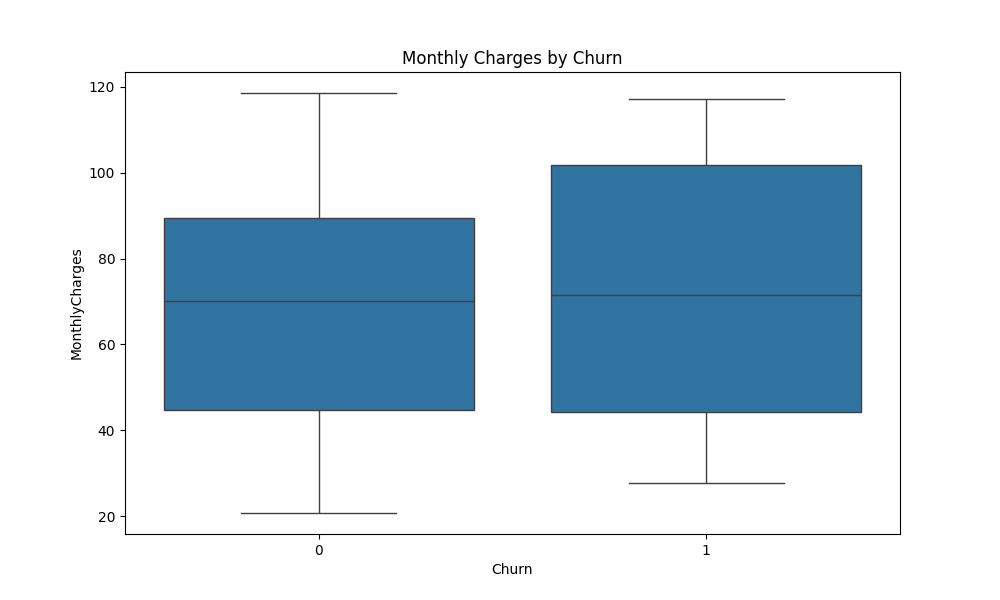
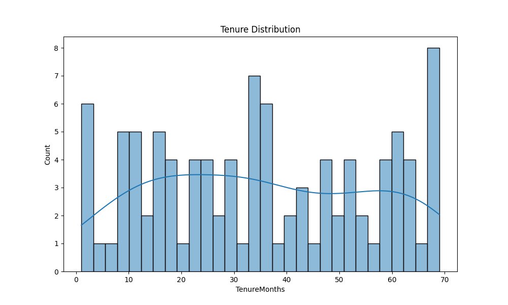

# 📉 Customer Churn Analysis (Python)

This project demonstrates a full workflow for analyzing customer churn in a telecom-like environment using a synthetic dataset. It includes data preparation, visualization, machine learning, and result interpretation — all in Python.

---

## 📂 Project Structure

```
customer-churn-analysis-python/
├── data/
│   └── customer_churn_data.csv
├── plots/
│   ├── churn_count.png
│   ├── monthly_charges_by_churn.png
│   └── tenure_distribution.png
├── scripts
│   └── customer_churn_analysis.py
└── README.md
```

---

## 🧠 Key Highlights

- 📊 Exploratory Data Analysis (EDA) with Seaborn
- 🤖 Random Forest Classifier for churn prediction
- 🧹 Data cleaning & feature engineering
- 📈 Insights on Monthly Charges, Tenure, and Contract Type

---

## 💾 How to Use

1. Clone the repository:

```bash
git clone https://github.com/YOUR_USERNAME/customer-churn-analysis-python.git
cd customer-churn-analysis-python
```

2. Install dependencies:

```bash
pip install pandas matplotlib seaborn scikit-learn
```

3. Run the analysis:

```bash
python customer_churn_analysis.py
```

4. Check the `plots/` folder for visual output.

---

## 🖼️ Sample Visualizations

### Churn Count  


### Monthly Charges by Churn  


### Tenure Distribution  


---

## 📌 Dataset Description

- 100 synthetic customer records
- Features include: `Gender`, `SeniorCitizen`, `MonthlyCharges`, `Tenure`, `ContractType`, etc.
- Binary target: `Churn` (Yes/No)

---

## 👨‍💻 Author

**Atifa Elmasry**  
Aspiring Data Analyst | Python | Data Visualization | Machine Learning

---

## 📄 License

This project is licensed under the MIT License.