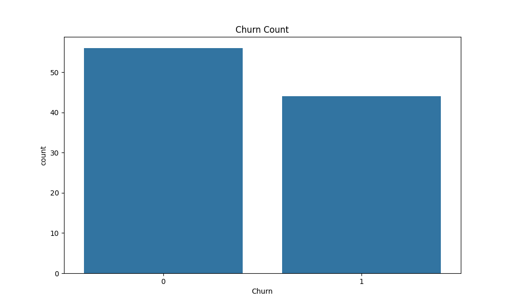
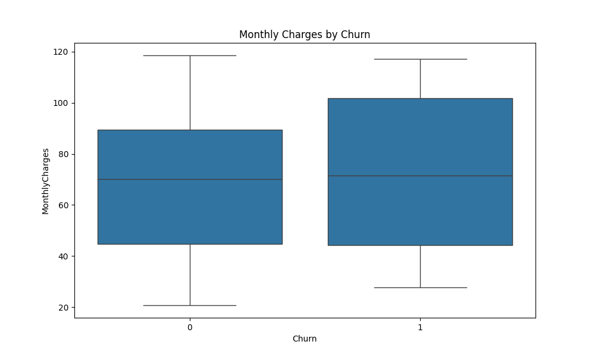
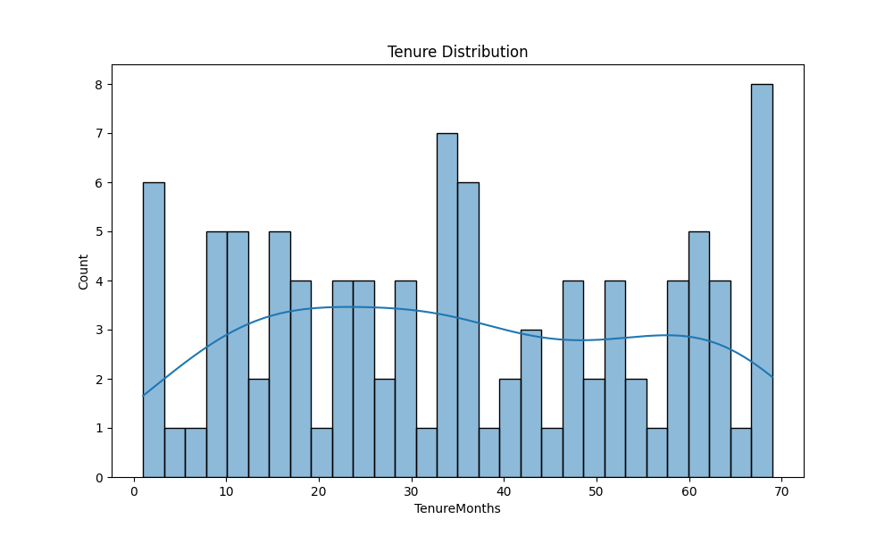

# Customer Churn Analysis

A Python workflow for exploring customer churn in a telecom-style business, combining exploratory analysis, feature preparation and a Random Forest classification model.

> The repository contains 100 synthetic customer records. It demonstrates the analytical process; the model is not suitable for production use at this sample size.

## Business question

Which customer characteristics are associated with churn, and how could a retention team use those signals to prioritize further investigation?

## Workflow

1. Cleaned customer and contract attributes.
2. Explored churn by tenure, monthly charges and contract type.
3. Prepared features for classification.
4. Trained a Random Forest model.
5. Interpreted patterns and generated visual outputs.

## Repository structure

```text
data/       Synthetic customer dataset
plots/      Generated visualizations
scripts/    Analysis script
README.md   Project documentation
```

## Visualizations

### Churn distribution



### Monthly charges by churn status



### Tenure distribution



## Reproduce the analysis

```bash
git clone https://github.com/AtifElmasry/customer_churn_data.git
cd customer_churn_data
pip install pandas matplotlib seaborn scikit-learn
python scripts/customer_churn_analysis.py
```

## Limitations and next steps

- Increase the sample size before relying on model performance.
- Use stratified cross-validation and report precision, recall, F1 and ROC–AUC.
- Compare the Random Forest with an interpretable logistic-regression baseline.
- Check class balance and tune the decision threshold around retention costs.
- Validate results on a separate time period or holdout population.

## Tools

Python, pandas, Matplotlib, Seaborn and scikit-learn

## Author

[Atif Elmasry](https://github.com/AtifElmasry) · [LinkedIn](https://www.linkedin.com/in/tioatifelmasry/)
